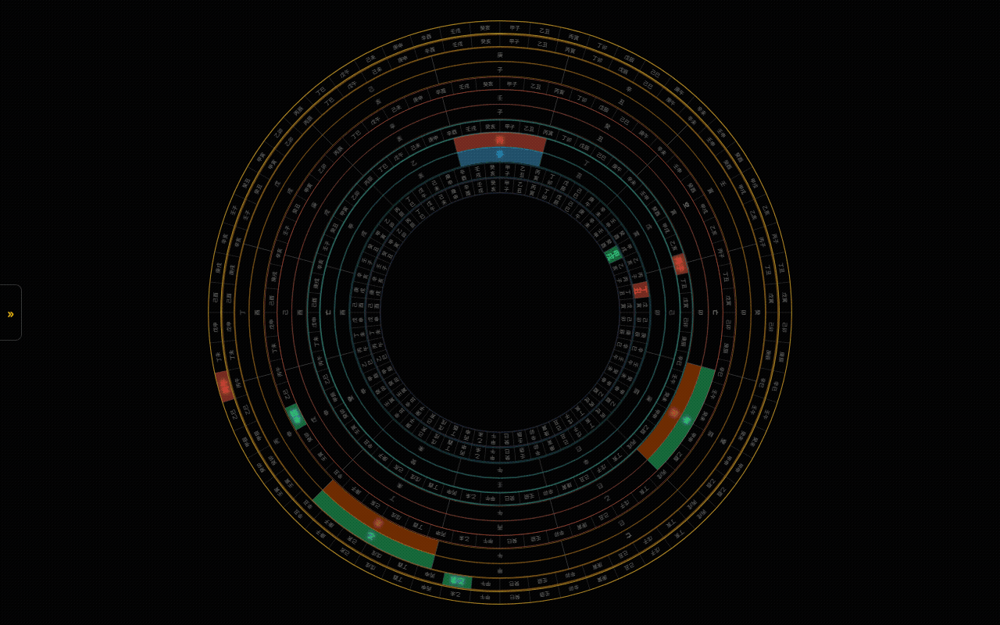

# 🧭 乙巳观 (Yisiguan)

> 道由天观。

把中国古代天文算法画成**可以看、可以转、可以随时间演化**的罗盘。



纸上读天文志，干支、节气、入宿度——全是数字，想象不出盘面长什么样。跑代码能算出来，但终究是终端里的数组。那就画出来，转起来，让时间走起来。

技术栈：**VitePress 1.6** · Vue 3.5 · TypeScript · SVG · [astronomy-engine](https://github.com/cosinekitty/astronomy) · [tyme4ts](https://github.com/6tail/tyme4ts)

## ✨ 罗盘

| | 罗盘 | 一句话 |
|---|------|--------|
| 🕐 | **六十甲子六环** | 年月日时分秒六柱同心环，实时干支追踪 |
| 🔮 | **先天六十四卦盘** | 伏羲圆图，六十四卦按二进制位反转排列，乾南坤北 |
| 📿 | **京房六日七分纳甲盘** | 60 卦 × 6 爻 = 360 位承载 365.25 天，当日值卦值爻实时高亮 |
| 🌌 | **七曜入宿天象盘** | 盖天投影，赤道·黄道·白道三道斜交，日月五星实时入二十八宿 |
| 🌙 | **回归年闰月盘** | 365 天回归年 vs 360 度甲子纪年，闰月与月相实时可视化 |
| ⭐ | **观斗盘** | 真实北斗七星（岁差修正）+ 紫微垣 + 地平圈（浏览器定位），斗柄读时辰、季节与年岁 |
| 🔗 | **卦关系盘** | 飞伏·互卦·对卦·综卦·交卦五种关系自由切换，中央有向箭头动态收敛 |
| 🗺️ | **苏州石刻天文图** | 南宋淳祐七年（1247）王致远勒石天文图数字复原，斗柄随本地恒星时旋转 |
| 🧭 | **二十四山风水盘** | 手机端罗盘，DeviceOrientation + WMM 磁偏角校正，整盘随手机旋转 |
| 🌀 | **阴阳遁九局盘** | 奇门遁甲九局体系，冬至 0° 起序，超神/接气/正授状态实时标注 |
| 🍃 | **五运六气盘** | 《素问》七篇大论，主气·客气·主运·客运四环，干支四柱实时显示 |
| ⚡ | **会合周期盘** | 五星两两会合赤经序列连线，10 对组合各成一色 |

访问：<https://andaoai.github.io/O/>

## 🏗️ 设计

项目**不使用 Vue Router**，也不是 SPA。所有罗盘都是 VitePress 页面——`docs/compass/*.md` 通过自定义 `layout: compass` 全屏渲染 `src/views/*.vue`。`src/` 是纯组件库，靠 `@` alias 被 VitePress 消费。

五层架构：**状态层 → 组合层 → 领域组件层 → 基础渲染层 → 工具层**，单一数据源 `controlledTime` 驱动一切。详见 [CLAUDE.md](CLAUDE.md)。

## 🚀 快速开始

```sh
npm install
npm run dev     # → http://localhost:5173/O/
```

罗盘页：`/O/compass/` · 可加 `?t=2026-01-01T00:00` 精确定位时间。

<details>
<summary>📦 项目结构</summary>

```
docs/                          # VitePress 站点根
├─ .vitepress/
│  ├─ config.ts                # 站点配置（base='/O/'、alias @→src/）
│  └─ theme/                   # 主题：Layout 分派 + 全局注册
├─ compass/                    # 罗盘页（layout: compass）
├─ books/                      # 古籍笔记（乙巳占、京氏易传）
├─ concepts/                   # 通用概念索引
└─ dev/                        # 站内开发文档

src/                           # 组件库（被 VitePress @ alias 消费）
├─ compasses/index.ts          # 罗盘注册表
├─ views/                      # 12 个罗盘 View
├─ components/
│  ├─ base/                    # PolarCanvas / CircleRing / RingStack …
│  ├─ rings/                   # 35+ 领域圆环组件
│  ├─ centers/                 # 圆心组件
│  └─ sidebar/                 # 嵌入式 Sidebar
├─ composables/                # useRingBase / useUrlTime / useViewport …
└─ utils/                      # 纯函数工具层
```

</details>

## 🚢 部署

推送到 `main` → GitHub Actions 自动构建部署到 GitHub Pages。

## 📄 许可证

[CC BY-NC 4.0](LICENSE) · Copyright © 2025-2026 陈柳安 (andaoai)

你可以阅读、学习、二次创作；需要署名并附带许可证链接；不可用于商业用途。商用授权请联系 <andaoai@qq.com>。
